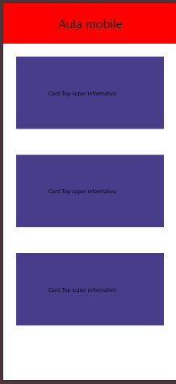

# 📱 Componentes do React Native

## Objetivo do projeto
### O objetivo deste projeto é criar uma página simples no React Native para criar componentes.

## 🛠️ Tecnologias utilizadas:
### <li> JavaScript;
### <li> React Native.

## 🤳 Páginas feitas:

